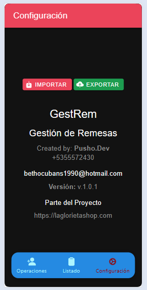

# Gest-Rem v 1.0.1
---------------

Aplicación móvil para gestionar remesas de activos a familiares y amigos

>[!NOTE]
>#### _Read this in [other languages](https://github.com/PushoDev/gest-rem/README.us.md)._ <kbd></kbd> <kbd></kbd>

## Descripción
---------------

La aplicación Gest-Rem es una herramienta para gestionar remitentes de envío de Remesas para familiares y amigos. Permite a los usuarios crear, y eliminar remitentes, así como visualizar la información de los remitentes.

## Requisitos
------------
>[!TIP]
> * Android 10 o superior
> * Ionic 6 o superior
> * Capacitor 6 o superior

## Instrucciones de compilación
-----------------------------

>[!IMPORTANT]
> * Para compilar la aplicación, sigue estos pasos:
> 1. **Clona el repositorio**: Clona el repositorio de GitHub utilizando el comando `git clone https://github.com/PushoDev/gest-rem`.
> 2. **Instala las dependencias**: Instala las dependencias necesarias utilizando el comando `npm install`.
> 3. **Compila la aplicación**: Compila la aplicación utilizando el comando `ionic build android`.
> 4. **Instala la aplicación**: Instala la aplicación en un dispositivo Android utilizando el comando `ionic cap run android`.

## Instrucciones de ejecución
---------------------------

Para ejecutar la aplicación, sigue estos pasos:

1. **Abre la aplicación**: Abre la aplicación en un dispositivo Android.
2. **Inicia sesión**: Inicia sesión con tu cuenta de usuario.
3. **Visualiza la información**: Visualiza la información de los remitentes.

## Imágenes de la aplicación
---------------------------

Aquí te presentamos algunas imágenes de la aplicación:

## Contribuciones
----------------

Si deseas contribuir al proyecto, por favor crea un fork del repositorio y envía una solicitud de pull con tus cambios.

## Licencia
------------

La aplicación Gest-Rem está bajo la licencia MIT. Puedes encontrar más información sobre la licencia en el archivo `LICENSE`.

## Contacto
------------

Si tienes alguna pregunta o necesitas ayuda, por favor no dudes en contactarme en [bethocubans1990@gmail.com](mailto:bethocubans1990@gmail.com).