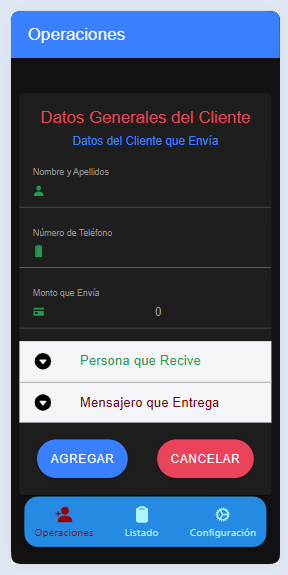
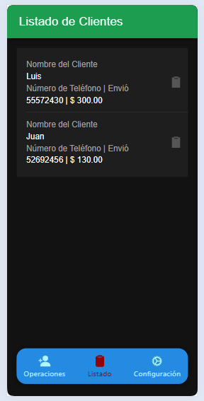
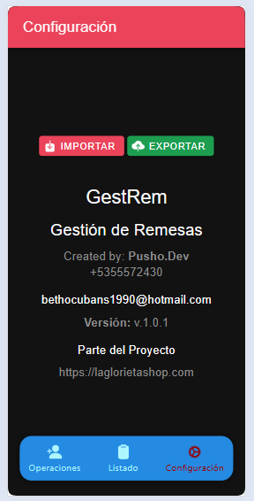

# Gest-Rem v 1.0.1
------------

Mobile application for managing remitters

>[!NOTE]
>#### _Leer en [otro Idioma](https://github.com/PushoDev/gest-rem)._ <kbd></kbd> <kbd></kbd>

## Description
-------------

The Gest-Rem application is a tool for managing remitters. It allows users to create, edit and delete remitters, as well as view information about the remitters.

## Requirements
------------

>[!TIP]
> * Android 10 or higher
> * Ionic 6 or higher
> * Capacitor 6 or higher

## Compilation Instructions
---------------------------

>[!IMPORTANT]
> * To compile the application, follow these steps:
> 1. **Clone the repository**: Clone the repository from GitHub using the command `git clone https://github.com/PushoDev/gest-rem`.
> 2. **Install dependencies**: Install the necessary dependencies using the command `npm install`.
> 3. **Compile the application**: Compile the application using the command `ionic build android`.
> 4. **Install the application**: Install the application on an Android device using the command `ionic cap run android`.

## Execution Instructions
-------------------------

To run the application, follow these steps:

1. **Open the application**: Open the application on an Android device.
2. **Log in**: Log in with your user account.
3. **View information**: View information about the remitters.

## Application Images
---------------------

Here are some images of the application:

## Contributions
----------------

If you want to contribute to the project, please create a fork of the repository and send a pull request with your changes.

## License
------------

The Gest-Rem application is under the MIT license. You can find more information about the license in the `LICENSE` file.

## Contact
------------

If you have any questions or need help, please don't hesitate to contact me at [bethocubans1990@gmail.com](mailto:bethocubans1990@gmail.com).